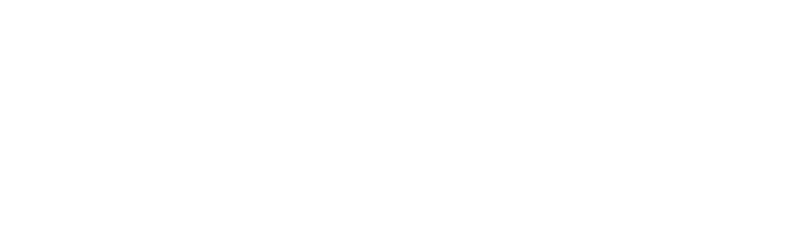

&nbsp;&nbsp;&nbsp;&nbsp;&nbsp;&nbsp;&nbsp;&nbsp;&nbsp;&nbsp;&nbsp;&nbsp;&nbsp;&nbsp;&nbsp;&nbsp;&nbsp;&nbsp;&nbsp;&nbsp;
&nbsp;&nbsp;&nbsp;&nbsp;&nbsp;&nbsp;&nbsp;&nbsp;&nbsp;&nbsp;&nbsp;&nbsp;&nbsp;&nbsp;&nbsp;&nbsp;&nbsp;&nbsp;&nbsp;&nbsp;
&nbsp;&nbsp;&nbsp;&nbsp;&nbsp;&nbsp;&nbsp;&nbsp;&nbsp;&nbsp;&nbsp;
[![Language][scala-shield]][scala-url]
[![MIT License][license-shield]][license-url]
[![Conventional Commits][conventional-commits-shield]][conventional-commits-url]

Repository containing tasks for Advanced Software Modelling and Design exam.

<!--
***
    GITHUB SHIELDS VARIABLES
***
-->

[scala-shield]: https://img.shields.io/badge/scala-%23DC322F.svg?style=flat&logo=scala&logoColor=white

[scala-url]: https://www.scala-lang.org/

[license-shield]: https://img.shields.io/github/license/FreshMag/asmd23-24.svg?style=flat

[license-url]: https://github.com/FreshMag/asmd23-24/blob/master/LICENSE

[conventional-commits-shield]: https://img.shields.io/badge/Conventional%20Commits-1.0.0-%23FE5196?logo=conventionalcommits

[conventional-commits-url]: https://conventionalcommits.org
